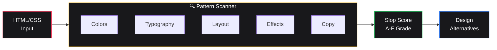

<div align="center">
  
  <p><strong>CLI tool that detects generic AI-generated design patterns (purple gradients, Inter font, etc.) in web projects.</strong></p>
  <p>
    <a href="https://demo-website-one-puce.vercel.app"><strong>🚀 Live Demo</strong></a>
  </p>
</div>

# 🚫 Anti-Slop

**Detect and prevent AI-generated "slop" aesthetic in web projects.** Scan your HTML/CSS for purple gradients, Inter font, glassmorphism, and other generic AI design patterns. Get a slop score and actionable alternatives to build more distinctive interfaces.

## What This Does

Anti-Slop analyzes your web projects to identify homogenized AI-generated design patterns that make websites look identical. It provides:

- **Pattern Detection** - Scans HTML/CSS for 20+ common "slop" indicators
- **Slop Score** - Rates your project from A-F based on generic pattern usage
- **Design Alternatives** - Suggests specific fonts, colors, and layouts to break the mold
- **AI Prompt Templates** - Pre-written prompts to guide AI tools toward better aesthetics

## Common Slop Patterns Detected

- 🟣 **Purple/indigo gradients** (the #1 offender)
- 📝 **Inter or Space Grotesk fonts** (overused defaults)
- 🔮 **3D blobs and floating orbs** as decoration
- 🪟 **Glassmorphism** (backdrop-blur everywhere)
- 📐 **Centered layouts** with excessive whitespace
- 🎴 **rounded-xl cards with shadow-md**
- 💬 **Generic copy** ("Transform your X", "AI-Powered Y")

## Installation

```bash
npm install anti-slop
```

## Usage

### CLI Scanner

```bash
# Scan your entire project
npx anti-slop scan ./src

# Quick check a single file
npx anti-slop check index.html

# Get design alternatives
npx anti-slop suggest fonts
npx anti-slop suggest colors

# Generate AI prompts
npx anti-slop prompts --system
```

### Programmatic Analysis

```typescript
import { analyze, quickCheck } from 'anti-slop';

// Full analysis with detailed breakdown
const result = analyze(htmlOrCssContent);
console.log(result.grade);      // 'A' | 'B' | 'C' | 'D' | 'F'
console.log(result.slopScore);  // 0-100 (higher = more slop)
console.log(result.detections); // Array of specific issues found

// Quick pass/fail check
const check = quickCheck(content);
if (check.isSlop) {
  console.log('Slop detected:', check.topIssues);
}
```

### Browser Bookmarklet

Analyze any live website:

1. Run `npx anti-slop bookmarklet` to get the bookmarklet URL
2. Save it as a browser bookmark
3. Click on any webpage to see real-time slop analysis

### AI Prompt Integration

```typescript
import { ANTI_SLOP_SYSTEM_PROMPT, getDesignKit } from 'anti-slop';

// Add to your AI prompts
const prompt = `${ANTI_SLOP_SYSTEM_PROMPT}
Design a landing page for a coffee shop...`;

// Get curated design alternatives
const kit = getDesignKit('brutalist-raw');
console.log(kit.fonts);  // ['JetBrains Mono', 'Space Mono']
console.log(kit.colors); // ['#000000', '#FF0000', '#FFFFFF']
```

## How It Works



## What Gets Flagged

The analyzer looks for patterns like:

- **Colors**: Purple gradients, default Tailwind purples, generic blue (#3B82F6)
- **Typography**: Inter, Space Grotesk, default system fonts
- **Layout**: Excessive centering, generic hero sections, card grids
- **Effects**: Glassmorphism, drop shadows, gradient overlays
- **Copy**: "Get Started Free", "Transform your business", AI buzzwords

## Design Kit Alternatives

Instead of generic patterns, try these curated design directions:

- **Brutalist Raw** - Bold typography, high contrast, geometric layouts
- **Swiss Precision** - Clean grids, limited color, perfect alignment  
- **Warm Editorial** - Serif fonts, earth tones, magazine-inspired
- **Forest Organic** - Natural colors, organic shapes, handwritten fonts
- **Noir Luxury** - Dark themes, gold accents, elegant typography

## What This Isn't

This tool is **not** about banning AI or specific design choices. It's about:

- ✅ Encouraging intentional design decisions
- ✅ Breaking out of homogenized aesthetics  
- ✅ Providing concrete alternatives
- ❌ Design policing or gatekeeping
- ❌ Anti-AI sentiment

## Contributing

Found a new slop pattern? Add it to `src/detector.ts`. Have a great design alternative? Contribute to `src/design-kits/`.

## License

MIT